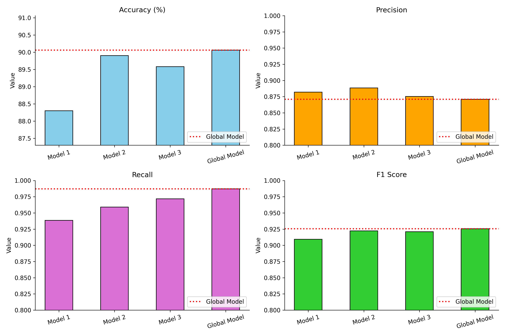

# Federated Chest X-Ray Classification

Decentralized deep learning for privacy-preserving medical imaging analysis using Federated Learning.


## Project Summary

This project demonstrates Federated Learning applied to chest X-ray classification, enabling multiple simulated hospitals (clients) to collaboratively train a Convolutional Neural Network (CNN) without sharing raw patient data. By implementing the Federated Averaging (FedAvg) algorithm and leveraging Message Passing Interface (MPI) for distributed communication, the project showcases how privacy-preserving machine learning can advance healthcare AI while maintaining strict data confidentiality. Built on the Chest X-Ray Pneumonia dataset, it serves as both an educational baseline and a foundation for production-grade federated systems.

Federated learning enables the development of superior global models by aggregating insights from multiple clusters of local models, while preserving patient data privacy at the source.

Below image shows the comparisons across various models:



## Overview

Healthcare institutions face critical barriers to collaborative AI development: patient data privacy regulations, data ownership concerns, and the practical challenges of centralizing sensitive medical information. This project addresses these challenges by implementing federated learning, where multiple institutions train a shared model locally on their data and only exchange model updates—never raw patient information.

The architecture simulates a realistic federated setting:

- **Multiple Clients**: Each represents a hospital or clinic with local chest X-ray data.
- **Central Server**: Aggregates model updates from all clients using FedAvg.
- **Distributed Communication**: MPI enables efficient parameter synchronization across clients.
- **Decentralized Training**: Clients perform independent CNN training rounds without data exposure.

The result is a globally optimized model that benefits from diverse, distributed data while preserving individual institution privacy.

## Significance

### Key Benefits and Goals

- **Privacy Preservation**: Raw patient data never leaves local institutions; only encrypted/aggregated model parameters are shared.
- **Distributed Training**: MPI-based orchestration enables realistic multi-client federated scenarios on a single machine.
- **Federated Averaging (FedAvg)**: Implements industry-standard aggregation ensuring convergence across heterogeneous client datasets.
- **Real-World Medical Dataset**: Leverages the publicly available Chest X-Ray Pneumonia dataset (Kaggle) for authentic healthcare scenarios.
- **Educational Baseline**: Provides clear, annotated code for researchers and practitioners learning federated learning, distributed systems, and privacy-preserving AI.
- **Extensibility**: Foundation for integrating Differential Privacy, Secure Aggregation, and production deployment.
- **Regulatory Compliance**: Architecture aligns with healthcare data protection regulations (HIPAA, GDPR) by design, facilitating deployment in clinical settings.
- **Cross-Institutional Collaboration**: Enables multiple healthcare institutions to jointly train superior diagnostic models without compromising patient confidentiality or data governance policies.

## Dataset

### Chest X-Ray Pneumonia Dataset

**Source**: [Kaggle - Chest X-Ray Images (Pneumonia)](https://www.kaggle.com/datasets/paultimothymooney/chest-xray-pneumonia)

**Contents**: Chest X-ray images (JPEG format) labeled as either Normal or Pneumonia. The dataset contains approximately 5,863 images across train, validation, and test splits.

**Dataset Structure**:

```
data/raw/chest_xray/
├── train/
│   ├── NORMAL/
│   └── PNEUMONIA/
├── val/
│   ├── NORMAL/
│   └── PNEUMONIA/
└── test/
    ├── NORMAL/
    └── PNEUMONIA/
```

### Setup Instructions

1. **Download the Dataset**:

   - Visit [Kaggle - Chest X-Ray Pneumonia](https://www.kaggle.com/datasets/paultimothymooney/chest-xray-pneumonia)
   - Download the dataset (requires Kaggle account)

2. **Extract and Place**:

   - Extract the downloaded archive
   - Place the `chest_xray` folder into `data/raw/`:

   ```bash
   mkdir -p data/raw
   # Extract chest_xray into data/raw/
   ```

3. **Verify Structure**:
   - Ensure the directory structure matches the layout above
   - Confirm all train, val, and test subdirectories are present

## Repository Structure

```
federated_xray/
├── data/
│   ├── partition_data.py              # Distribute dataset across simulated clients
│   ├── data_loader.py                 # Custom DataLoader for client partitions
│   └── raw/
│       └── chest_xray/                # Raw dataset (user-provided)
│
├── federated/
│   ├── client.py                      # Client-side local training and evaluation
│   ├── server.py                      # Server-side aggregation logic
│   └── fed_avg.py                     # Federated Averaging algorithm implementation
│
├── models/
│   └── cnn_model.py                   # CNN architecture for X-ray classification
│
├── utils/
│   ├── metrics.py                     # Evaluation metrics (accuracy, precision, recall, F1)
│   └── visualize.py                   # Training curves and confusion matrix visualization
│
├── mpi_train.py                       # Main MPI orchestration script
├── results/                           # Output directory for logs, models, and plots
│   ├── logs/
│   ├── models/
│   └── plots/
├── requirements.txt                   # Python package dependencies
└── README.md                          # This file
```

### File Descriptions

| File/Folder              | Purpose                                                                                                         |
| ------------------------ | --------------------------------------------------------------------------------------------------------------- |
| `data/partition_data.py` | Splits the Chest X-Ray dataset into non-overlapping, simulated client partitions with configurable distribution |
| `data/data_loader.py`    | Provides PyTorch DataLoaders for training and validation on partitioned client data                             |
| `federated/client.py`    | Implements client-side training loop, model update computation, and local evaluation                            |
| `federated/server.py`    | Aggregates model updates from all clients using FedAvg; coordinates global rounds                               |
| `federated/fed_avg.py`   | Core FedAvg algorithm for weighted parameter averaging                                                          |
| `models/cnn_model.py`    | Defines CNN architecture optimized for medical image classification                                             |
| `utils/metrics.py`       | Computes accuracy, precision, recall, F1-score, and generates confusion matrices                                |
| `utils/visualize.py`     | Plots training/validation curves, loss trends, and model performance visualizations                             |
| `mpi_train.py`           | Entry point for distributed federated training; orchestrates MPI communication                                  |
| `results/`               | Stores trained models, training logs, and generated plots                                                       |

## Setup and Installation

### Prerequisites

- Python 3.8 or higher
- pip or conda
- MPI installation (mpich or OpenMPI)
- 4+ GB RAM recommended

### Step-by-Step Installation

1. **Clone the Repository**:

   ```bash
   git clone <repository-url>
   cd federated_xray
   ```

2. **Download and Place Dataset**:

   - Download the Chest X-Ray Pneumonia dataset from Kaggle (see [Dataset](#dataset) section)
   - Extract and place into:

   ```bash
   mkdir -p data/raw
   # Place chest_xray folder here: data/raw/chest_xray/
   ```

3. **Create Virtual Environment**:

   ```bash
   python3 -m venv venv
   source venv/bin/activate  # On Windows: venv\Scripts\activate
   ```

4. **Install Python Dependencies**:

   ```bash
   pip install --upgrade pip
   pip install -r requirements.txt
   ```

5. **Install MPI**:

   **Ubuntu/Debian**:

   ```bash
   sudo apt-get update
   sudo apt-get install mpich
   ```

   **macOS**:

   ```bash
   brew install mpich
   ```

   **Windows**: Download and install from [MPICH official website](https://www.mpich.org/download/)

6. **Verify Installation**:
   ```bash
   mpiexec --version
   python -c "import torch; print(torch.__version__)"
   ```

## Running the Project

### Workflow Overview

The federated learning pipeline consists of three main stages:

#### Stage 1: Partition Dataset

Distribute the Chest X-Ray dataset across multiple simulated client nodes:

```bash
python data/partition_data.py --num_clients 3 --split_type iid
```

**Options**:

- `--num_clients`: Number of federated clients (default: 3)
- `--split_type`: Data distribution strategy - `iid` (Independent and Identically Distributed) or `non_iid`
- `--data_dir`: Path to raw dataset (default: `data/raw/chest_xray/`)
- `--output_dir`: Output directory for partitions (default: `data/partitions/`)

#### Stage 2: Run Federated Training

Execute federated learning with MPI-based distributed training:

```bash
mpiexec -n 4 python mpi_train.py --rounds 10 --epochs 5 --batch_size 32
```

**Parameters**:

- `-n 4`: Total processes = 1 server + 3 clients (adjust as needed)
- `--rounds`: Number of federated communication rounds (default: 10)
- `--epochs`: Local training epochs per client per round (default: 5)
- `--batch_size`: Training batch size (default: 32)
- `--learning_rate`: Optimizer learning rate (default: 0.001)
- `--device`: Compute device - `cuda` or `cpu` (default: auto-detect)

**Example with custom parameters**:

```bash
mpiexec -n 6 python mpi_train.py --rounds 20 --epochs 3 --batch_size 16 --learning_rate 0.0005
```

#### Stage 3: View Results

Results are automatically saved to the `results/` directory:

- **Logs**: `results/logs/training_log.txt` - Detailed round-by-round metrics
- **Models**: `results/models/global_model_final.pth` - Trained global model
- **Plots**: `results/plots/training_curves.png` - Accuracy and loss visualizations

View training curves:

```bash
# Plots are auto-generated; open with any image viewer
open results/plots/training_curves.png  # macOS
xdg-open results/plots/training_curves.png  # Linux
```

## Configuration and Hyperparameters

Edit these files to customize behavior:

| File                     | Parameter         | Default        | Description                 |
| ------------------------ | ----------------- | -------------- | --------------------------- |
| `mpi_train.py`           | `--rounds`        | 10             | Total federated rounds      |
| `mpi_train.py`           | `--epochs`        | 5              | Local epochs per client     |
| `mpi_train.py`           | `--batch_size`    | 32             | Training batch size         |
| `mpi_train.py`           | `--learning_rate` | 0.001          | SGD learning rate           |
| `models/cnn_model.py`    | Hidden layers     | [64, 128, 256] | CNN channel progression     |
| `data/partition_data.py` | `--num_clients`   | 3              | Number of federated clients |

## Important Notes

- **Local Simulation**: The project currently simulates federated learning on a single machine using MPI processes. In production, clients would run on separate devices/institutions.
- **Model Complexity**: The CNN is intentionally simplified for educational clarity. Production systems may use ResNet50, EfficientNet, or Vision Transformers.
- **Non-IID Data**: The non-IID partition option simulates realistic healthcare scenarios where each institution has different case distributions (e.g., varying pneumonia prevalence).
- **Convergence**: FedAvg convergence depends on the number of clients, local epochs, and data heterogeneity. Experiment with parameters to observe trade-offs.

## Future Extensions

- **Differential Privacy**: Integrate DP-SGD for per-client privacy guarantees.
- **Secure Aggregation**: Implement cryptographic aggregation to prevent server snooping.
- **Personalized Federated Learning**: Enable per-client model fine-tuning while maintaining global collaboration.
- **Real-World Deployment**: Extend to actual distributed infrastructure (edge devices, cloud clusters).
- **Advanced Architectures**: Integrate Vision Transformers or domain-specific medical imaging models.
- **Communication Efficiency**: Implement compression and quantization techniques.

## Tech Stack

| Component             | Technology             |
| --------------------- | ---------------------- |
| Language              | Python 3.8+            |
| Deep Learning         | PyTorch 1.9+           |
| Distributed Computing | MPI (mpich or OpenMPI) |
| Data Processing       | NumPy, Pandas          |
| Visualization         | Matplotlib, Seaborn    |
| ML Utilities          | Scikit-learn           |
| GPU Support           | CUDA 11.0+ (optional)  |

## Contact and Contributions

We welcome contributions, bug reports, and feedback from the community. If you encounter issues, have suggestions, or would like to contribute improvements, please:

- **Open an Issue**: For bug reports or feature requests on the project repository.
- **Submit a Pull Request**: To contribute code improvements or new features.
- **Reach Out**: For questions or discussions about federated learning and privacy-preserving AI.

This project aims to support research, education, and practical implementation of federated learning in healthcare and other privacy-sensitive domains. Your feedback helps advance the field of decentralized, privacy-preserving machine learning.

---
